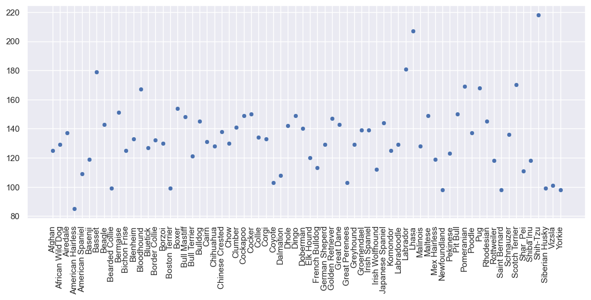
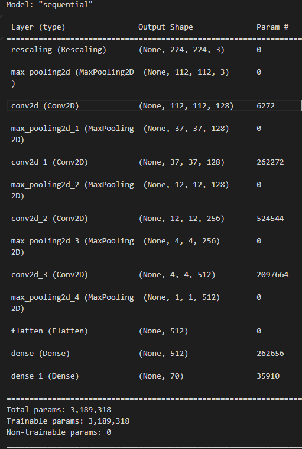
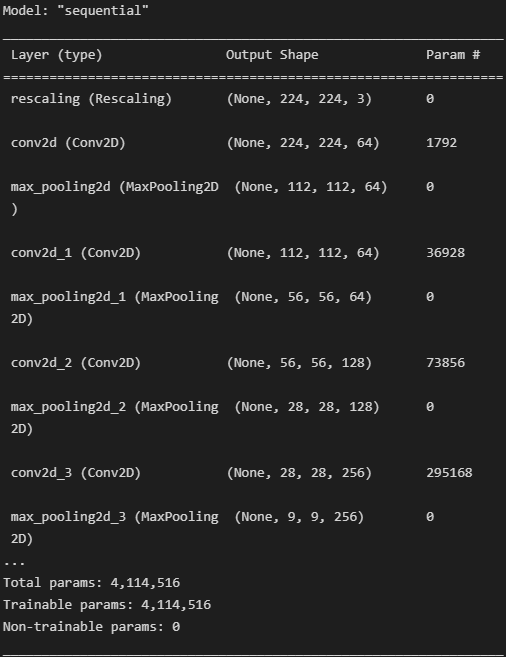
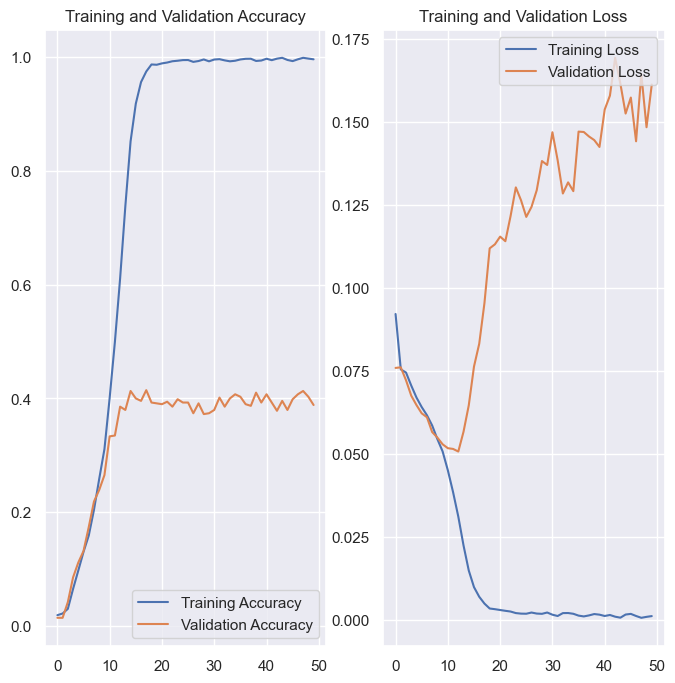
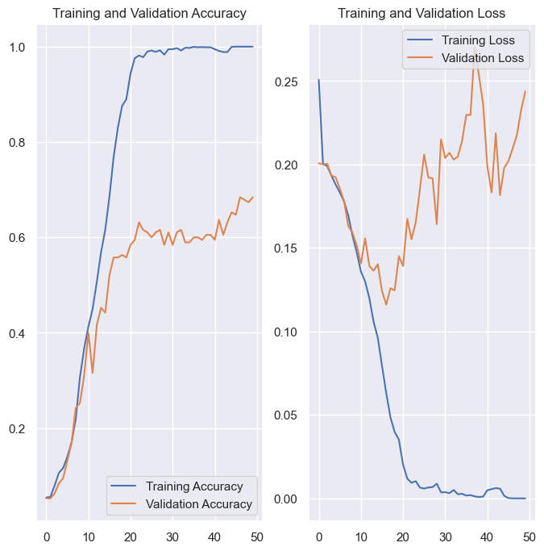
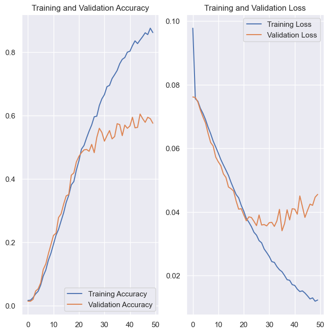

# ML.Project.ecs171

## Introduction

Our group project aims to generate a Convolutional Neural Net (CNN) that will classify .jpg input images of dogs into one of 70 breeds. Through supervised training of the model, we hope to generate a CNN that is capable of classifying a large variety of breeds to help dog owners identify the breed of their canine.

//potential reasons chosen
We decided on identifying dogs because they are a very familiar pet and seemed like an adequate challenge. Our previous homework had us decide if an image contained a cat or not, and we decided to take this further with dogs and be able to decide the breed of the dog. This data set was also already partially preprocessed allowing for more time to create models to be tested.

//maybe preprocessing info
Sadly we had not realized early on that the total number of images per breed was not enough to properly train the model leading to us having to create more images from the already given images by using data augmentation.

## Data Exploration

(Data_Exploration.ipynb)

Our data is extracted from a Kaggle dataset containing 7946 train, 700 validation, 700 test, images (of 224X224 RGB jpg format): each dog breed contains at least 78 image examples.

The neural net will utilize a convolutional layer and hidden layer(s) to intake a .jpg image as input and output a breed class for the image (American Spaniel, Afghan, Bloodhound, etc.).



## Preprocessing Data

As the images are of the same dimension and contain the same features of the subject and position them in the same frame, central location, and resolution, most of the logistics around centering and changing the image size are not necessary.

Thus, our preprocessing is focused on normalizing the colored pixels for the neural net and simplifying the resolution of the images to improve the run time of the neural net. We will rescale the images so the pixel colors are associated with a normalized value, through the keras image preprocessing library.

We will assess if data augmentation is necessary, but we are planning on initially implementing pixel normalization and resolution  reduction.

For Model 2 we dropped 50 classes and only kept the first 20 dog breeds to make it easier on the NN as we found 70 classes to be difficult to decipher due to a lack of images for each class. This was unforeseen until after we trained our first model. Sienna confirmed this assumption in an office hour.

## First Model and Performing Preprocessing

We continued forward by developing a CNN model that operates on rescaled image data, where the pixels were normalized per their RGB pixel colors.

Our first model is a CNN that consists of a rescaling layer, five complexity reduction layers (MaxPooling2D- one after the rescaling and each convolutional layer), four convolutional layers, and three dense layers. As visible in our Jupyter Notebook, the training and “validation” graphs refer to the training accuracy and loss between our training set and a separate subset for testing.

It has been labeled as validation, but it is a separate set from the training and was used to test the efficacy of the neural net. As one can tell from the graphs, since our model is increasing in complexity, but our accuracy is about 50% (random chance equivalent), and our loss is significantly higher than our training loss: the information suggests that since our model is maintaining a steady 50% loss, the model's failings may be accredited to not enough training data. We will adjust for this by performing data augmentation on our current images (blurring the images, rotating the images, etc), running it through our current model, and creating another model if necessary.

## Model 1 70 Breeds no aug

This is the first NN that we thought was sufficient to train our model. It is made up of one rescaling layer, 5 MaxPooling layer, 4 Convolutional layers, and 2 dense layers. 



```python

cnnModel = Sequential()

cnnModel.add(Rescaling((1. / 1), input_shape = (224, 224, 3)))
cnnModel.add(MaxPooling2D((2, 2)))
cnnModel.add(Conv2D(128, 4, padding = 'same', activation = 'relu'))
cnnModel.add(MaxPooling2D((3, 3)))
cnnModel.add(Conv2D(128, 4, padding = 'same', activation = 'relu'))
cnnModel.add(MaxPooling2D((3, 3)))
cnnModel.add(Conv2D(256, 4, padding = 'same', activation = 'relu'))
cnnModel.add(MaxPooling2D((3, 3)))
cnnModel.add(Conv2D(512, 4, padding = 'same', activation = 'relu'))
cnnModel.add(MaxPooling2D((3, 3)))

cnnModel.add(Flatten())

cnnModel.add(Dense(512, activation='relu'))
cnnModel.add(Dense(70, activation='softmax'))
```

## Model 2 20 Breeds no aug

This model is similar to the first with a few additions. First is an additional MaxPooling and Convolutional Layer. Second is two additional dense layers.

We also did an extra preprocessing step by only keeping the first 20 output classes. Reducing output classes from 70 to 20.



```python
cnnModel = Sequential()

cnnModel.add(Rescaling((1. / 1), input_shape = (224, 224, 3)))
cnnModel.add(Conv2D(64, 3, padding = 'same', activation = 'relu'))
cnnModel.add(MaxPooling2D((2, 2)))
cnnModel.add(Conv2D(64, 3, padding = 'same', activation = 'relu'))
cnnModel.add(MaxPooling2D((2, 2)))
cnnModel.add(Conv2D(128, 3, padding = 'same', activation = 'relu'))
cnnModel.add(MaxPooling2D((2, 2)))
cnnModel.add(Conv2D(256, 3, padding = 'same', activation = 'relu'))
cnnModel.add(MaxPooling2D((3, 3)))
cnnModel.add(Conv2D(512, 3, padding = 'same', activation = 'relu'))
cnnModel.add(MaxPooling2D((3, 3)))

cnnModel.add(Flatten())

cnnModel.add(Dense(512, activation='relu'))
cnnModel.add(Dense(256, activation='relu'))
cnnModel.add(Dense(128, activation='relu'))
cnnModel.add(Dense(len(Classes), activation='softmax'))
```

## Model 3 70 Breeds aug

put some more stuff here

## Results

### Model 1 Results



### Model 2 Results



### Model 3 Results



## Discussion

### NN Design

Our aim was to create a NN that would allow us to classify images of dogs by their breed. To do this we decided to use a series of convolutional layers along with our dense layers. Keras Convolutional layers API gives us multiple tools to efficiently analyze 2D images. Convolutional layers are use full because they allow for recognition of edges and shapes which is perfect for image classification. Another use full tool is MaxPulling which reduces the number of dimensions of the feature map leading to a reduction in required computation. As you may have noticed all of the layers use the Relu activation function. Relu was chosen because in our research on image classification relu was noted as being all around great activation function.

### Result Breakdown

#### Model 1

After training our first model we noted a short coming in our data set. We had around 8000 images for 70 classes leading to about 100 images for each class. With the complexity of the model, 100 images was no where near enough information for the model to learn to properly distinguish the classes from each other. This is why Model 1 has such a low validation accuracy. (Sienna helped us realize this issue and some potential solutions we explore in our future models)

#### Model 2

For good measure we added an additional convolutional layer and two additional dense layers. The main difference though was an extra preprocessing step to be sure that the lack of data was why we had such a low validation accuracy of 40%. We reduced the number of output classes from 70 to 20. This leads to the model being able to rely on more distinct differences in dogs in a smaller set images and the breeds. This theory lead to an increased validation accuracy to almost 70%. This proved our assumption that the lack of images per breed was causing the model to have a low accuracy.

#### Model 3


## Conclusion

## Collaboration Section