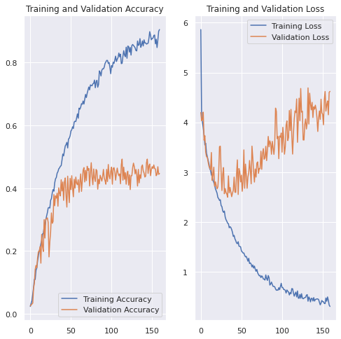

# ML.Project.ecs171

## Introduction

As man’s best friends, dogs are integral in many people’s lives and are widely regarded as protectors, pets, and even family members. Adding a new furry addition to the family can be expensive, but can be mitigated through adoption from shelters and pounds. However, most adopted dogs are not identified via their breed, thus our group endeavors to provide an algorithmic method of identifying the dog’s breed, so new owners can provide their dog with the best care (grooming, food, common health issues associated with the breed). Through the generation of a supervised learning model, our team designed a Convolutional Neural Network (CNN) that classifies dog images (.jpg) into one of 70 breeds. The convolutional neural network returns a 55% accuracy, to sufficiently classify the dogs, utilizing data image augmentation, and convolutional layers to filter image complexity.

## Data Exploration

Our data was acquired through Kaggle.com, and contains 7946 train, 700 validation, and 700 test images. As such, each dog breed file has at least 65 (american hairless) to 198 (Shih-Tzu) training images [generating a total range of 85-218 images per breed]. 
Plotted below are the number of training images per breed, the range mentioned above factors in the images in the test and validation folder.

'''
Our data is extracted from a Kaggle dataset containing 7946 train, 700 validation, 700 test, images (of 224X224 RGB jpg format): each dog breed contains at least 78 image examples.

The neural net will utilize a convolutional layer and hidden layer(s) to intake a .jpg image as input and output a breed class for the image (American Spaniel, Afghan, Bloodhound, etc.).
'''


After visualizing the information (via Data_Exploration.ipynb), we assessed the images which were all of 224X224 RGB jpg format, and required no resizing, cropping, or initial normalization to standardize the images. From our image data, we assessed at least one convolutional layer and hidden layer(s) would be needed to intake a .jpg image as input and output a breed class for the image (American Spaniel, Afghan, Bloodhound, etc.).

## Preprocessing Data

As the images are of the same dimension and contain the same features of the subject and position them in the same frame, central location, and resolution, most of the logistics around centering and changing the image size are not necessary.

Thus, our preprocessing is focused on normalizing the colored pixels for the neural net and simplifying the resolution of the images to improve the run time of the neural net. We will rescale the images so the pixel colors are associated with a normalized value, through the keras image preprocessing library.

We will assess if data augmentation is necessary, but we are planning on initially implementing pixel normalization and resolution reduction.


## First Model and Performing Preprocessing

We continued forward by developing a CNN model that operates on rescaled image data, where the pixels were normalized per their RGB pixel colors.

Our first model is a CNN that consists of a rescaling layer, five complexity reduction layers (MaxPooling2D- one after the rescaling and each convolutional layer), four convolutional layers, and three dense layers. As visible in our Jupyter Notebook, the training and “validation” graphs refer to the training accuracy and loss between our training set and a separate subset for testing.

It has been labeled as validation, but it is a separate set from the training and was used to test the efficacy of the neural net. As one can tell from the graphs, since our model is increasing in complexity, but our accuracy is about 50% (random chance equivalent), and our loss is significantly higher than our training loss: the information suggests that since our model is maintaining a steady 50% loss, the model's failings may be accredited to not enough training data. We will adjust for this by performing data augmentation on our current images (blurring the images, rotating the images, etc), running it through our current model, and creating another model if necessary.

## Model 1 70 Breeds- No Augmentation (No-Aug)

This is the first CNN that we thought was sufficient to train our model. It is made up of one rescaling layer, 5 MaxPooling layer, 4 Convolutional layers, and 2 dense layers. 


```python

cnnModel = Sequential()

cnnModel.add(Rescaling((1. / 1), input_shape = (224, 224, 3)))
cnnModel.add(MaxPooling2D((2, 2)))
cnnModel.add(Conv2D(128, 4, padding = 'same', activation = 'relu'))
cnnModel.add(MaxPooling2D((3, 3)))
cnnModel.add(Conv2D(128, 4, padding = 'same', activation = 'relu'))
cnnModel.add(MaxPooling2D((3, 3)))
cnnModel.add(Conv2D(256, 4, padding = 'same', activation = 'relu'))
cnnModel.add(MaxPooling2D((3, 3)))
cnnModel.add(Conv2D(512, 4, padding = 'same', activation = 'relu'))
cnnModel.add(MaxPooling2D((3, 3)))

cnnModel.add(Flatten())

cnnModel.add(Dense(512, activation='relu'))
cnnModel.add(Dense(70, activation='softmax'))
```

## Model 2 20 Breeds- No-Aug

We adjusted our first model by limiting our dataset to only the initial 20 classes to determine the model’s classification performance. Additionally, our second model, though very similar to the first, contains additional MaxPooling, Convolutional, and two dense layers (link: Model_2_20breeds.ipynb).


```python
cnnModel = Sequential()

cnnModel.add(Rescaling((1. / 1), input_shape = (224, 224, 3)))
cnnModel.add(Conv2D(64, 3, padding = 'same', activation = 'relu'))
cnnModel.add(MaxPooling2D((2, 2)))
cnnModel.add(Conv2D(64, 3, padding = 'same', activation = 'relu'))
cnnModel.add(MaxPooling2D((2, 2)))
cnnModel.add(Conv2D(128, 3, padding = 'same', activation = 'relu'))
cnnModel.add(MaxPooling2D((2, 2)))
cnnModel.add(Conv2D(256, 3, padding = 'same', activation = 'relu'))
cnnModel.add(MaxPooling2D((3, 3)))
cnnModel.add(Conv2D(512, 3, padding = 'same', activation = 'relu'))
cnnModel.add(MaxPooling2D((3, 3)))

cnnModel.add(Flatten())

cnnModel.add(Dense(512, activation='relu'))
cnnModel.add(Dense(256, activation='relu'))
cnnModel.add(Dense(128, activation='relu'))
cnnModel.add(Dense(len(Classes), activation='softmax'))
```

## Model 3 70 Breeds aug

For model 3, we utilized data augmentation layers consisting of RandomFlip, RandomRotation, and RandomZoom to generate significantly more images of the ideal size. By augmenting the original images we can create additional testing data to improve the accuracy and learning of our CNN. The figures below contain an excerpt of code for our model.


```python
#Source Used for Data Augmentation
#https://www.tensorflow.org/tutorials/images/data_augmentation

data_augmentation = tf.keras.Sequential([
  layers.RandomFlip("horizontal"),
  layers.RandomRotation(0.3),
  layers.RandomZoom(0.2)
])

cnnModel = Sequential()

cnnModel.add(data_augmentation)

cnnModel.add(Rescaling((1. / 1), input_shape = (224, 224, 3)))
cnnModel.add(Conv2D(64, 3, padding = 'same', activation = 'relu'))
cnnModel.add(MaxPooling2D((2, 2)))
cnnModel.add(Conv2D(64, 3, padding = 'same', activation = 'relu'))
cnnModel.add(MaxPooling2D((2, 2)))
cnnModel.add(Conv2D(128, 3, padding = 'same', activation = 'relu'))
cnnModel.add(MaxPooling2D((2, 2)))
cnnModel.add(Conv2D(256, 3, padding = 'same', activation = 'relu'))
cnnModel.add(MaxPooling2D((2, 2)))
cnnModel.add(Conv2D(512, 3, padding = 'same', activation = 'relu'))
cnnModel.add(MaxPooling2D((2, 2)))


cnnModel.add(Flatten())

cnnModel.add(Dense(512, activation='relu'))
cnnModel.add(Dense(256, activation='relu'))
cnnModel.add(Dense(128, activation='relu'))
cnnModel.add(Dense(len(Classes), activation='softmax'))

```

## Results

### Model 1 Results


Through a graphic method, we plotted the accuracy and validation loss of the model to training and validation data- providing a point for every epoch. The first model depicts an average accuracy of 40% and an average cost of 0.137 across 50 epochs.

### Model 2 Results


The graph of the model’s results follow the same structure as Model 1, and we found that the limiting of the model’s input data to 20 classes pushed our accuracy to approximately 70%, and our training loss to less than 0.25 across 50 epochs.

### Model 3 Results



The graph of the third model’s results follow the same procedure of the graphs prior to it, and depicts an overall accuracy of 55%, and a training loss of approximately 0.06 across 50 epochs.

## Discussion

### CNN Design

Our aim was to create a NN that would allow us to classify images of dogs by their breed. To do this we decided to use a series of convolutional layers along with our dense layers. Keras Convolutional layers API gives us multiple tools to efficiently analyze 2D images. Convolutional layers are use full because they allow for recognition of edges and shapes which is perfect for image classification. Another use full tool is MaxPulling which reduces the number of dimensions of the feature map leading to a reduction in required computation. As you may have noticed all of the layers use the Relu activation function. Relu was chosen because in our research on image classification relu was noted as being all around great activation function.

### Result Breakdown

#### Model 1

After training our first model we noted a short coming in our data set. We had around 8000 images for 70 classes leading to about 100 images for each class. With the complexity of the model, 100 images was no where near enough information for the model to learn to properly distinguish the classes from each other. This is why Model 1 has such a low validation accuracy. (Sienna helped us realize this issue and some potential solutions we explore in our future models)

#### Model 2

For good measure we added an additional convolutional layer and two additional dense layers. The main difference though was an extra preprocessing step to be sure that the lack of data was why we had such a low validation accuracy of 40%. We reduced the number of output classes from 70 to 20. This leads to the model being able to rely on more distinct differences in dogs in a smaller set images and the breeds. This theory lead to an increased validation accuracy to almost 70%. This proved our assumption that the lack of images per breed was causing the model to have a low accuracy.

#### Model 3

With newfound information we were determined to create an accurate model for our entire data set. To do this we researched a method called data augmentation. Data Augmentation is when you transform the image to look at the same data in a different way. This was accomplished by adding three augmentation layers to increase the number of images the NN had to train on. This worked to our benefit, compared to Model 1 it performs 20% better increasing our accuracy to just below 60% with all 70 breeds.

Augmentation was a quick crutch to our lack of training data. However, it does not make up for the shier lack of images we started with. A better model would have more real images of dogs and would not have to so heavily rely on data augmentation as heavily.

## Conclusion

Overall we believe that with the data set we selected we were able to make a model that gave a respectable result. As a group we were able to adjust to the challenges that our data set provided. Given more time we could have utilized web scraping to increase the size of our training data. Even with this we would still want to use our augmentation because this would still allow our NN to identify dogs that may be photographed in less then conventional angles. We also could have explored the convolutional NN layers API more extensively. We have only scraped the surface of the tools that were available to us. This project was exciting as it mimicked real world application of NN and image recognition. Many of us did not realize how complex image classification is and leave the project with a more nuanced understanding of Image classification using NN works.   

## Collaboration Section

Yuan Zhai - Main designer of the NN models. Majority writer of the code past the Data exploration stage.

Zachary Hom - Data exploration, Wrote code for alternative method of image augmentation, ReadMe co-editor/writer.

Nathan Diaz - Data exploration co-code writer,  ReadME co-editor/writer, notebook cleaner.

Jion Hwang - Data exploration, Researching Data Augmentation, co-editing/writing Readme.

Kiyomi Blackmun - Project Manager, github Manager, ReadME co-writing, ReadME Final Editor.

Kai Janowicz - Data exploration co-code writer, Code Debugger, ReadME co-editor/writer, notebook cleaner, and style lead.